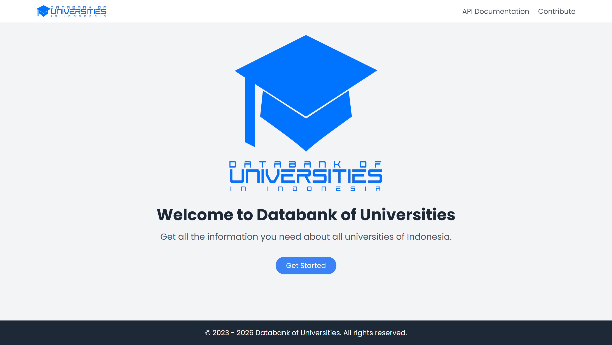
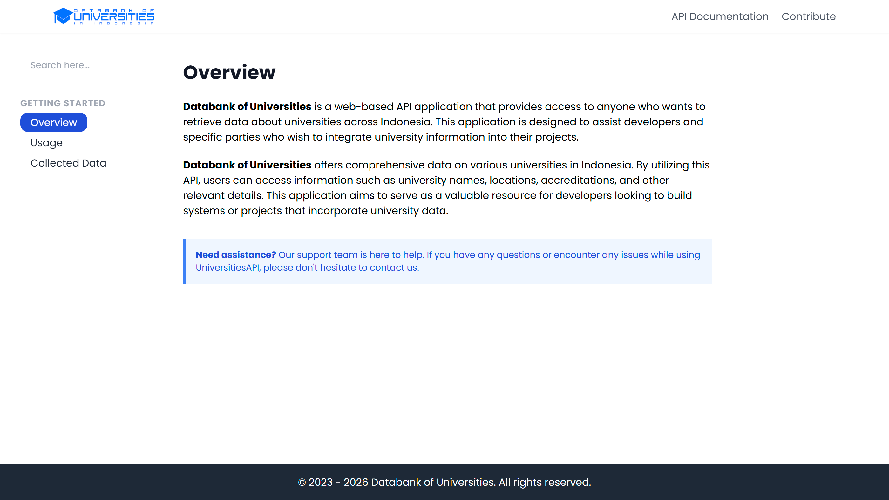
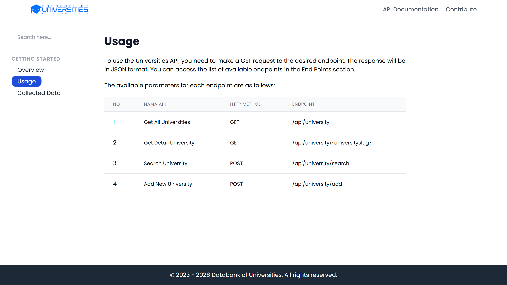

# Databank Universitas Indonesia

Selamat datang di Databank Universitas Indonesia! Proyek ini adalah platform berbasis web untuk mengelola dan menyediakan data universitas di seluruh Indonesia. Terdapat antarmuka web untuk pengguna dan REST API publik untuk developer.

## Preview / Screenshot
Berikut adalah cuplikan tampilan dari aplikasi ini:




## Fitur Utama

* **Pencarian Data:** Mencari universitas berdasarkan nama atau lokasi.
* **REST API:** Menyediakan endpoint API publik untuk mengakses data universitas secara terprogram.
* **Sistem Pengguna:** Terdapat peran untuk `administrator`, `contributor`, dan `coders` untuk mengelola data.
* **Dokumentasi API:** Halaman khusus untuk melihat panduan penggunaan API.
* **Halaman Kontribusi:** Memungkinkan pengguna untuk ikut serta menambahkan data baru.

## Teknologi

* PHP 8.3+
* Laravel Framework 11.x
* Tailwind CSS
* MySQL

## Instalasi

1.  **Clone repository:**
    ```bash
    git clone [https://github.com/fazallsaid/databankofuniversities.git](https://github.com/fazallsaid/databankofuniversities.git)
    cd databankofuniversities
    ```

2.  **Install dependensi PHP:**
    ```bash
    composer install
    ```

3.  **Buat file environment:**
    Salin file `.env.example` menjadi `.env`.
    ```bash
    cp .env.example .env
    ```

4.  **Generate application key:**
    ```bash
    php artisan key:generate
    ```

5.  **Konfigurasi Database:**
    Buka file `.env` dan sesuaikan pengaturan database (DB\_DATABASE, DB\_USERNAME, DB\_PASSWORD) dengan konfigurasi lokal kamu.

6.  **Jalankan Migrasi & Seeder Database:**
    Perintah ini akan membuat struktur tabel dan mengisi data awal universitas.
    ```bash
    php artisan migrate --seed
    ```


7.  **Jalankan server development:**
    ```bash
    php artisan serve
    ```
    Aplikasi akan berjalan secara default di `http://127.0.0.1:8000`.

## API Endpoints

Berikut adalah daftar endpoint yang tersedia.

### Mengambil Semua Data Universitas

* **Method:** `GET`
* **Endpoint:** `/api/universities`
* **Deskripsi:** Mendapatkan seluruh daftar universitas yang ada di database.
* **Respons Sukses (200):**
    ```json
    {
        "success": true,
        "message": "All Universities of Indonesia (5 Universities)",
        "data": [
            {
                "university_id": 1,
                "university_name": "Universitas Gadjah Mada",
                "university_acronym": "UGM",
                "university_address": "DI Yogyakarta",
                "created_at": "...",
                "updated_at": "..."
            }
        ]
    }
    ```

### Menambahkan Universitas Baru

* **Method:** `POST`
* **Endpoint:** `/api/universities`
* **Deskripsi:** Menambahkan data universitas baru.
* **Body (form-data):**
    * `university_name` (string, required)
    * `university_acronym` (string, required)
    * `university_address` (string, required)
* **Respons Sukses (200):**
    ```json
    {
        "success": true,
        "message": "Universitas Berhasil Ditambahkan",
        "data": {
            "university_name": "Universitas Coding Keren",
            "university_acronym": "UCK",
            "university_address": "Internet",
            "updated_at": "...",
            "created_at": "...",
            "university_id": 6
        }
    }
    ```

### Mengupdate Data Universitas

* **Method:** `PUT`
* **Endpoint:** `/api/universities/{id}`
* **Deskripsi:** Memperbarui data universitas berdasarkan ID.
* **Body (x-www-form-urlencoded):**
    * `university_name` (string, required)
    * `university_acronym` (string, required)
    * `university_address` (string, required)
* **Respons Sukses (200):**
    ```json
    {
        "success": true,
        "message": "Universitas Berhasil Diupdate",
        "data": {
            "university_id": 6,
            "university_name": "Universitas Keren Sekali",
            "university_acronym": "UKS",
            "university_address": "Cloud",
            "created_at": "...",
            "updated_at": "..."
        }
    }
    ```

### Menghapus Data Universitas

* **Method:** `DELETE`
* **Endpoint:** `/api/universities/{id}`
* **Deskripsi:** Menghapus data universitas berdasarkan ID.
* **Respons Sukses (200):**
    ```json
    {
        "success": true,
        "message": "Universitas Universitas Keren Sekali Berhasil Dihapus"
    }
    ```

### Mencari Universitas (berdasarkan nama)

* **Method:** `GET`
* **Endpoint:** `/api/universities/search/name`
* **Deskripsi:** Mencari universitas dengan kata kunci pada namanya.
* **Query Params:**
    * `university_name` (string, required)
* **Respons Sukses (200):**
    ```json
    {
        "success": true,
        "message": "Universitas dengan kata kunci UGM (1 Universitas)",
        "data": [
            {
                "university_id": 1,
                "university_name": "Universitas Gadjah Mada",
                "university_acronym": "UGM",
                "university_address": "DI Yogyakarta",
                "created_at": "...",
                "updated_at": "..."
            }
        ]
    }
    ```

### Mencari Universitas (berdasarkan alamat/provinsi)

* **Method:** `GET`
* **Endpoint:** `/api/universities/search/address`
* **Deskripsi:** Mencari universitas dengan kata kunci pada alamatnya.
* **Query Params:**
    * `provinces` (string, required)
* **Respons Sukses (200):**
    ```json
    {
        "success": true,
        "message": "Universitas di Provinsi Yogyakarta (1 Universitas)",
        "data": [
            {
                "university_id": 1,
                "university_name": "Universitas Gadjah Mada",
                "university_acronym": "UGM",
                "university_address": "DI Yogyakarta",
                "created_at": "...",
                "updated_at": "..."
            }
        ]
    }
    ```

## Kontribusi

Kami sangat terbuka untuk kontribusi! Jika kamu menemukan data yang salah atau ingin menambahkan universitas baru, silakan gunakan halaman `/contribute` atau buat *Pull Request*.

## Lisensi

Proyek ini berada di bawah lisensi **Apache License 2.0**. Silakan lihat file [LICENSE](LICENSE) untuk detail lengkapnya.
